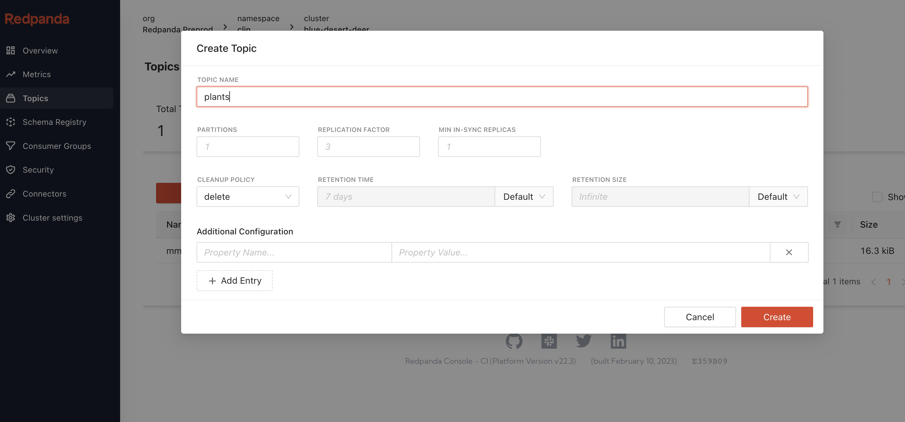
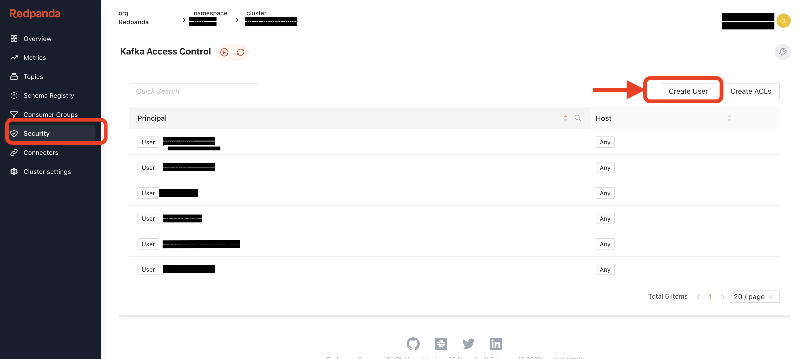
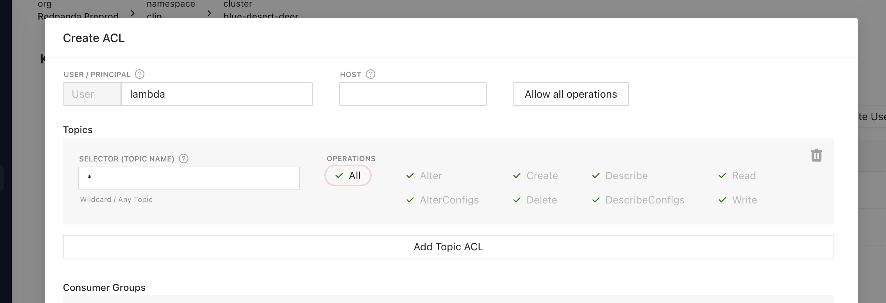

# Redpanda BYOC Demo


Here is a quick demo showcasing different ways you can connect to the Redpanda BYOC cluster. 

A simulator microservices(python) is deployed in Kubernetes and continuously publishes signal events, the Kubernetes cluster sits in its own VPC and is now connecting to the Redpanda cluster via VPC peering. 
Another consumer client(Java Quarkus) consumes the events externally. I have set up the BYOC in a public subnet, therefore it can connect via the internet gateway. 

The signal also triggers a Lambda serverless application, instead of using an MSK or SNS. The Lambda service also sits in its own VPC, in order to connect them, similar to AWS MSK and Kinesis,  establishing an VPC peering connection will do the trick. In my example, for better security, I have enabled SASL for authentication purposes. I choose to use the secret manager to store the credentials for Lamba triggers. In this case, make sure you update the access policy for your lambda role, so it has permission to get the credential stored. 


## Setup (Prerequisite)

You will need to have an EKS already running in it's own VPC 
and an empty VPC with one AZ, private subnet. 
 - TODO automate EKS & 2 VPCs


## Create an BYOC Redpanda Cluster
See documentation or video.

After Redpanda cluster started, create a Topic name *plants* 


Click on the Security in the left menu, setup the access control to the cluster by creating a new user with Mechanism SCRAM-SHA-256.



Remember your id & password. 

Create three sets of the credential, for all three clients
- Python publisher (for example ID/PWD robot/xxxxxx)
- Quarkus consumer (for example ID/PWD java-user/yyyyyy)
- Lambda consumer (for example ID/PWD lamabda/zzzzzzz)
  
and configure all three ACLs, we'll grant all permissions to all topics for now. 




## Start the Consumers (Quarkus)

### Running the external java consumer on your local machine. 
Go to folder **quarkus_app** 

```
cd quarkus_app
```
edit the _application.properties_  and update the bootstrap server & login credential (pick one of the user created in the previous section)

- kafka.bootstrap.servers=<BYOC_SEED_SERVERADDR>
- sasl.username=<CONSUMER_USERNAME>
- sasl.password=<CONSUMER_PASSWORD>

Run following commend to start the consumer:

```
mvn quarkus:dev
```

### Running the serverless Lambda app.


## Deploy the Python publisher

Make sure you have access and logged into the EKS for running the microservice applications. 

Create a new namespace to run the microservices.

```
kubectl create -f namespace.yml
```


Add configuration with credentials needed to communicate to Redpanda cluster.

```
kubectl create -f configmap.yml
```


Deploy the python application and start sending random events into the cluster. 

```
kubectl create -f deployment.yml
```
