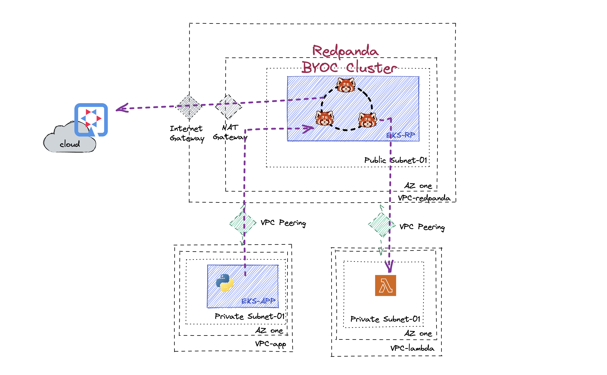
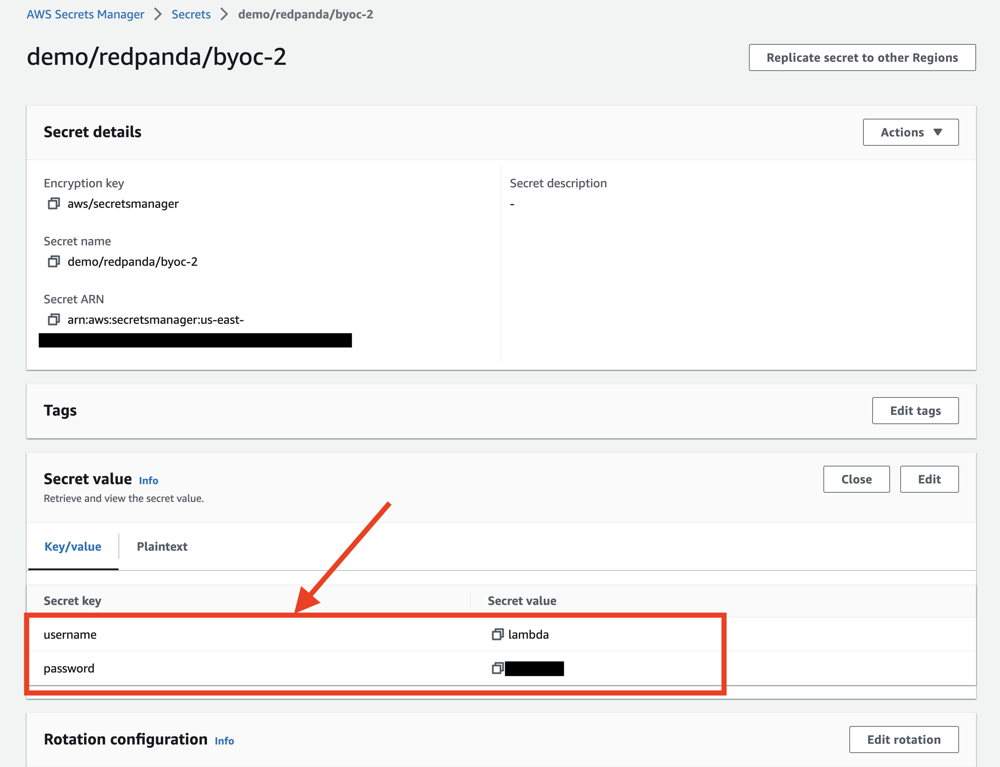
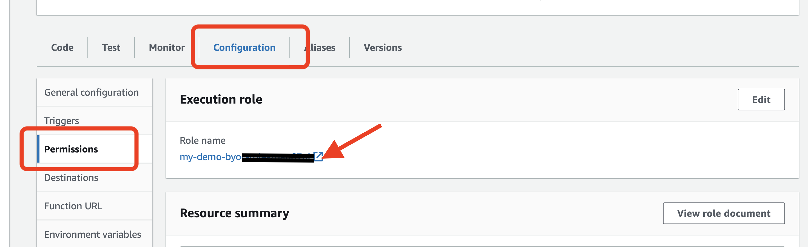
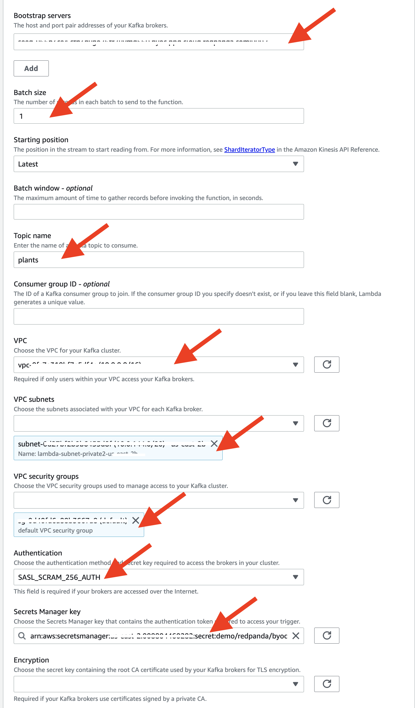
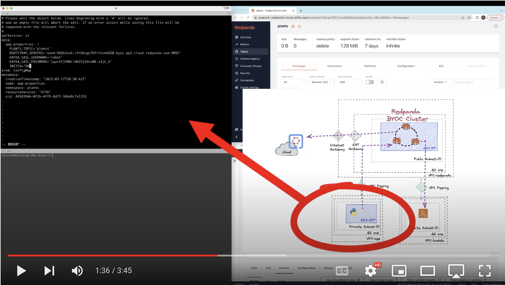

# Redpanda BYOC Demo


Here is a quick demo showcasing different ways you can connect to the Redpanda BYOC cluster. 

A simulator microservices(python) is deployed in Kubernetes and continuously publishes signal events, the Kubernetes cluster sits in its own VPC and is now connecting to the Redpanda cluster via VPC peering. 
Another consumer client(Java Quarkus) consumes the events externally. I have set up the BYOC in a public subnet, therefore it can connect via the internet gateway. 

The signal also triggers a Lambda serverless application, instead of using an MSK or SNS. The Lambda service also sits in its own VPC, in order to connect them, similar to AWS MSK and Kinesis,  establishing an VPC peering connection will do the trick. In my example, for better security, I have enabled SASL for authentication purposes. I choose to use the secret manager to store the credentials for Lamba triggers. In this case, make sure you update the access policy for your lambda role, so it has permission to get the credential stored. 




## Setup (Prerequisite)

You will need to have an EKS already running in it's own VPC 
and an empty VPC with one AZ, private subnet. 

Create a small EKS cluster

```
eksctl create cluster --name redpanda \
    --external-dns-access \
    --nodegroup-name standard-workers \
    --node-type t2.small \
    --nodes 3 
```

And [create a VPC for Lambda](https://docs.aws.amazon.com/codebuild/latest/userguide/cloudformation-vpc-template.html) 

Create VPC peering between 
- Lambda VPC to the VPC that runs the BYOC Redpanda Cluster
- Newly created EKS's VPC to the VPC that runs the BYOC Redpanda Cluster
  
  
_TODO: automate above instructions_


## Create an BYOC Redpanda Cluster
See documentation or video.

After Redpanda cluster started, create a Topic name *plants* 


Click on the Security in the left menu, setup the access control to the cluster by creating a new user with Mechanism SCRAM-SHA-256.


Remember your id & password. 

Create three sets of the credential, for all three clients
- Python publisher (for example ID/PWD robot/xxxxxx)
- Quarkus consumer (for example ID/PWD java-user/yyyyyy)
- Lambda consumer (for example ID/PWD lamabda/zzzzzzz)
  
and configure all three ACLs, we'll grant all permissions to all topics for now. 


## Start the Consumers (Quarkus)

### Running the external java consumer on your local machine. 
Go to folder **quarkus_app** 

```
cd quarkus_app
```
edit the _application.properties_  and update the bootstrap server & login credential (pick one of the user created in the previous section)

- kafka.bootstrap.servers=<BYOC_SEED_SERVERADDR>
- sasl.username=<CONSUMER_USERNAME>
- sasl.password=<CONSUMER_PASSWORD>

Run following commend to start the consumer:

```
mvn quarkus:dev
```

### Running the serverless Lambda app.

Let's first setup the credential for lambda to access the redpanda cluster. 


Create new Lambda function with the runtime of your choice. Do whatever you want in the function, in my case, I simple created a Ruby app that log the events. 

Let's setup the lambda function's role permission, 
 

Add the _secretsmanager_ read permission to above role. 
```
    {
            "Sid": "VisualEditor",
            "Effect": "Allow",
            "Action": [
                "secretsmanager:GetResourcePolicy",
                "secretsmanager:GetSecretValue",
                "secretsmanager:DescribeSecret",
                "logs:CreateLogGroup",
                "secretsmanager:ListSecretVersionIds"
            ],
            "Resource": [
                "arn:aws:secretsmanager:us-xx-x:xxxx:secret:demo/redpanda/byoc-2-xxxxx"
            ]
        }
```
Now,we are ready to setup the trigger, select *Apache Kafka* as source. 
And configure the following:

- Bootstrap servers : Your Redpanda seed server address
- Batch size:  1 (For demo purpose)
- Topic name: plants
- VPC: Choose the VPC you created for Lambda functions in prerequisite step
- VPC Subnets: Pick any of the private subnet
- VPC security groups: In my case, I just picked the default group (Change this base on your security policies)
- Authentication:  SASL_SCRAM_256_AUTH
- Secrets Manager key: Choose the credential you just added in Secrets Manager in the previous step


 


## Deploy the Python publisher

Make sure you have access and logged into the EKS for running the microservice applications.
(check your _kubeconfig_ file if you have problem accessing the cluster) 

Create a new namespace to run the microservices.

```
kubectl create -f namespace.yml
```

Add configuration with credentials needed to communicate to Redpanda cluster.

```
kubectl create -f configmap.yml -n plants
```

Deploy the python application and start sending random events into the cluster. 

```
kubectl create -f deployment.yml -n plants
```

Check if deployed successfully. 

```
> kubectl get pod -n plants
NAME                         READY   STATUS    RESTARTS   AGE
plant-bot-6d84f54c98-2d8v9   1/1     Running   0          12s
```


## Running the demo

Edit the _configmap_ and turn on the switch to start publishing data

```
kubectl edit configmap app-properties -n plants
```

Start consuming localing using the Quarkus Java client

```
mvn quarkus:dev
```

View changes in your Lambda monitoring dashboard and Redpanda Cloud UI. 


[](https://youtu.be/G5U_shbr--s)

